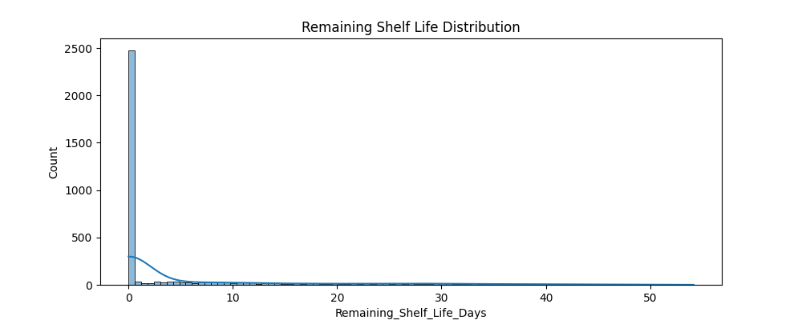
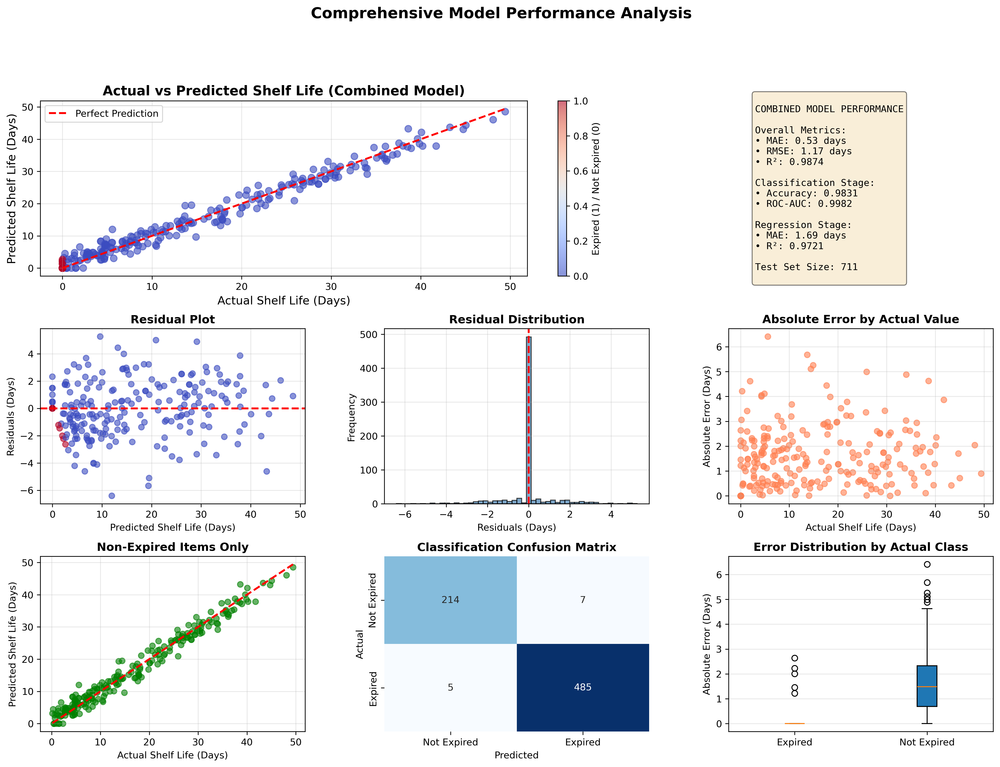
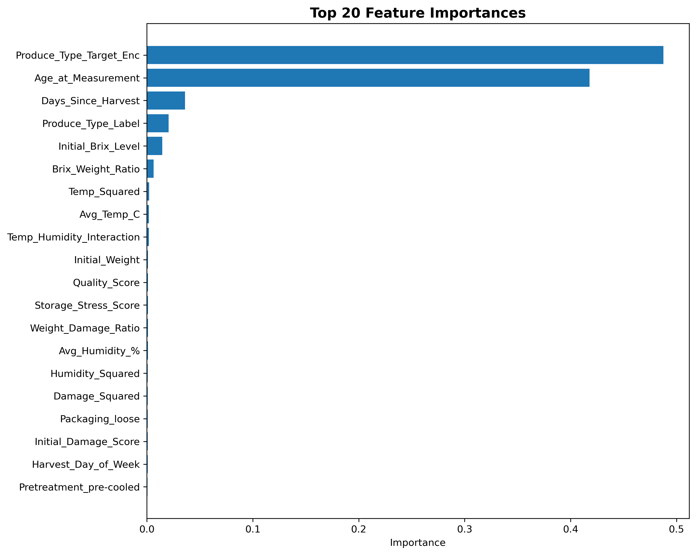
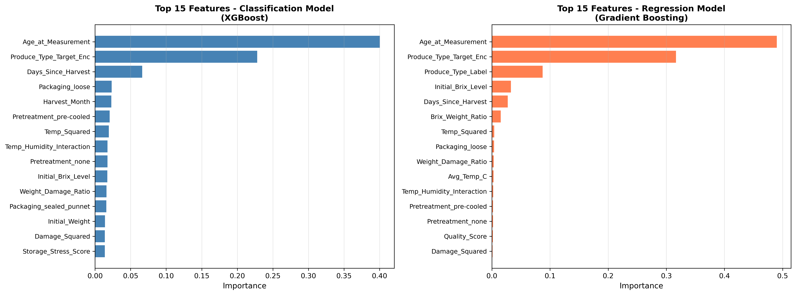
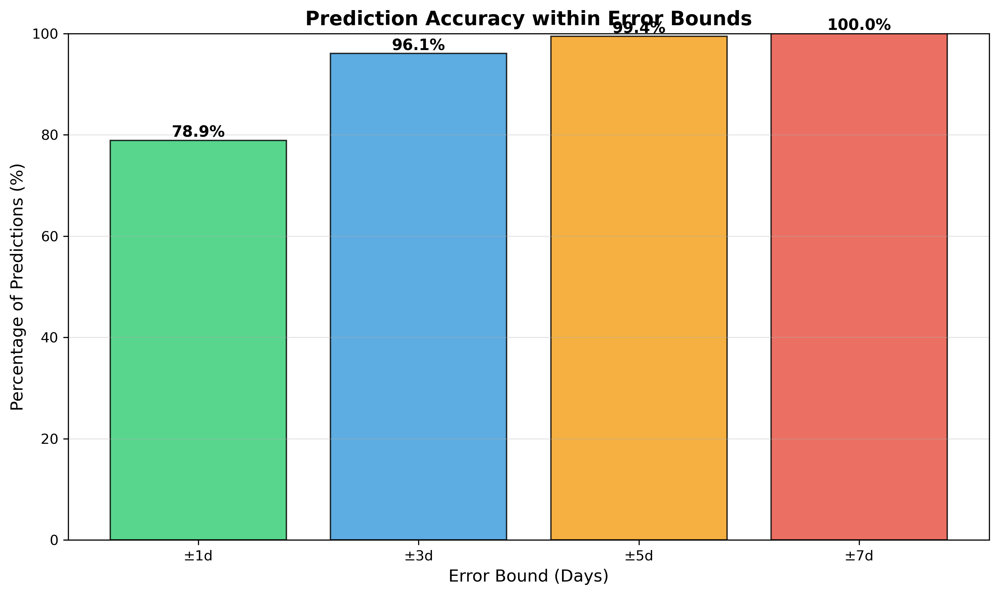
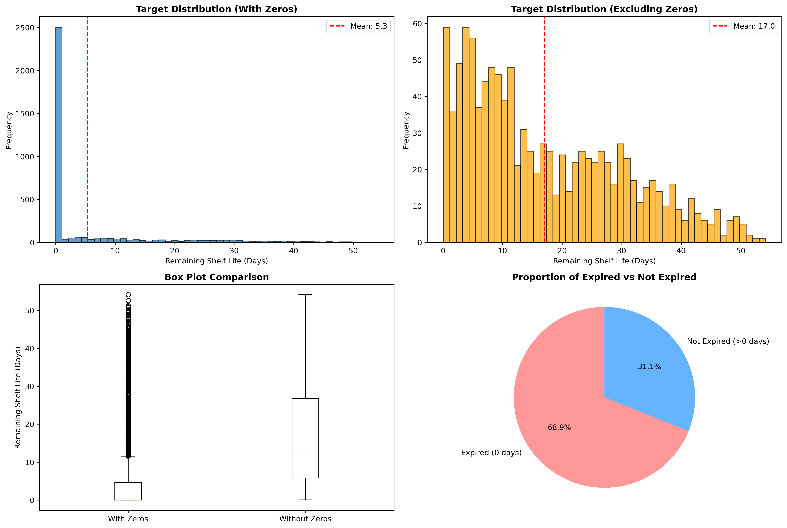
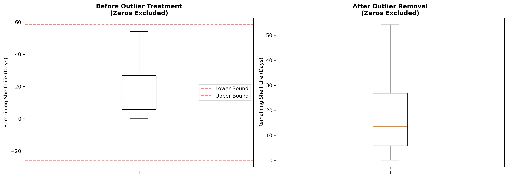
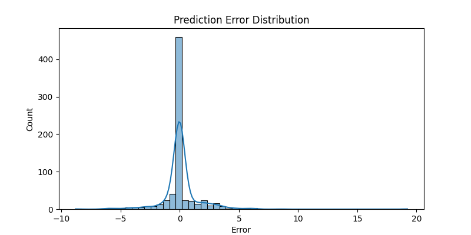

# 🍎 FreshGuard — Shelf Life Predictor


> **Predict remaining shelf life of produce with ML + Flask** 🥕🍌🍇

FreshGuard is a supervised machine learning project that predicts the remaining shelf life (in days) for various produce items. It combines a robust regression pipeline with a beautiful web UI for easy predictions.

## ✨ Key Features

- 🤖 **Multiple Model Training**: Linear Regression, Ridge, Lasso, Random Forest, Gradient Boosting
- 🎯 **Smart Defaults**: Missing technical values (Brix/Firmness) auto-filled with dataset averages
- 🌐 **Flask Web UI**: Easy-to-use form interface with validated dropdowns
- 📊 **Rich Dataset**: 3500+ produce samples with quality metrics
- 🎨 **Beautiful Design**: Responsive glassmorphic UI with real-time predictions
- ⚡ **Fast Serving**: Lazy-loaded model artifacts, zero retrain on serve

## 📊 Dataset Overview

| Aspect | Details |
|--------|---------|
| **File** | `Datasets/FreshGuard_RAW_dirty.csv` |
| **Samples** | 3,552 produce records |
| **Target** | `Remaining_Shelf_Life_Days` |
| **Features** | 6 numeric + 3 categorical (9 total) |
| **Framework** | Flask + scikit-learn |

## 📋 Requirements

- **Python 3.10+** (developed & tested with 3.12)
- **pip** or **conda** for package management
- All dependencies in `requirements.txt`

## 🚀 Quick Start

### 1️⃣ Setup (macOS / zsh)

Create and activate a virtual environment:

```bash
python -m venv .venv
source .venv/bin/activate
```

### 2️⃣ Setup on Windows (PowerShell / CMD)
Create virtual environment
```bash
python -m venv .venv
```
Activate virtual environment in PowerShell:
```bash
.venv\Scripts\Activate
```
Install dependencies:

```bash
pip install -r requirements.txt
```

**Optional:** In VS Code, select the `.venv` interpreter:
- Command Palette → `Python: Select Interpreter`
- Choose `<project>/.venv/bin/python`

### 2️⃣ Train the Model

Run the full training pipeline (loads data, preprocesses, trains models, saves artifacts):

```bash
make train
# or: python app.py
```

**Artifacts created:**
- `best_regressor.pkl` — selected best model
- `scaler.pkl` — feature scaler
- `encoders.pkl` — categorical encoders
- `metadata.pkl` — feature metadata
- `*.png` — training visualizations

**Training visualization:**



### 3️⃣ Run the Web Server

Start the Flask server on port 8080 (no retraining):

```bash
make serve
# or: python app.py --serve
```

Open your browser: **http://127.0.0.1:8080**

**Model Performance:**



## 📈 Analysis & Insights

### Feature Importance



### Feature Importance (Both Models)



### Prediction Accuracy



### Target Distribution



### Outlier Detection



### Error Distribution



## 🔌 API & Prediction Endpoint

### POST `/predict`

The web form POSTs to `/predict` with fields from `metadata.pkl`. The server expects saved artifacts; if missing, it shows an error.

**Example curl request** (fields match encoders):

```bash
curl -X POST http://127.0.0.1:8080/predict \
  -F "Initial_Brix_Level=15.2" \
  -F "Initial_Weight=120.5" \
  -F "Initial_Damage_Score=2.3" \
  -F "Avg_Temp_C=4.5" \
  -F "Avg_Humidity_%=78" \
  -F "Age_at_Measurement=3" \
  -F "Produce_Type=apple" \
  -F "Pretreatment=none" \
  -F "Packaging=loose"
```

**Response:** JSON or HTML with predicted shelf life in days.

## 📝 Dataset & Features

**Raw data:** `Datasets/FreshGuard_RAW_dirty.csv` (3,552 rows, 12 columns)

**Numeric Features:**
- `Initial_Brix_Level` — sugar content
- `Initial_Weight` — weight in grams
- `Initial_Damage_Score` — damage severity
- `Avg_Temp_C` — storage temperature
- `Avg_Humidity_%` — storage humidity
- `Age_at_Measurement` — days since harvest

**Categorical Features:**
- `Produce_Type` — fruit/vegetable type
- `Pretreatment` — post-harvest treatment
- `Packaging` — packaging type

**Development notes**
- The training pipeline is implemented in `app.py` in `run_pipeline()`; serving the web UI is done by running `python app.py --serve`.
- The server finds `index.html` in the project root (the code sets `Flask(..., template_folder='.')`) so you can keep the HTML file in the repo root.
- If you prefer the standard Flask layout, move the HTML into `templates/index.html`.

## ✅ Valid Categorical Values

**Produce_Type** (may include typos from original data):
```
aple, appel, apple, banana, bananna, graepe, grape, orange, ornge, potato, potto, strawberry, stawberry, tomato, tomto
```

**Pretreatment**:
```
none, pre-cooled, unknown, washed, waxed
```

**Packaging**:
```
carton, loose, perforated_bag, sealed_punnet, unknown
```

Use these exact strings when posting to `/predict` or selecting from the form dropdown.

## 🛠 Makefile Commands

Fast shortcuts for common tasks:

```bash
make install          # Create .venv and install dependencies
make train            # Run training pipeline
make serve            # Start Flask server (port 8080)
make clean            # Remove generated artifacts (*.pkl, *.png)
make status           # Show git status
```

All commands use `.venv` binaries directly for consistency across shells.

## 🛠 Development & Architecture

**Training Pipeline** (`app.py` → `run_pipeline()`):
1. Load & clean data
2. Feature engineering (encode categorical, scale numeric)
3. Train 5 models (LR, Ridge, Lasso, RF, GB)
4. Select best by RMSE
5. Save artifacts + metadata

**Flask Server** (`app.py --serve`):
- Lazy-loads pickled artifacts on first prediction
- Serves `index.html` from project root
- `/` route: static form page
- `/predict` route: process form, call model, return result

**File Structure:**
```
.
├── app.py                          # Training + Flask app
├── index.html                      # Web UI (project root)
├── Makefile                        # Convenience targets
├── requirements.txt                # Dependencies
├── Datasets/
│   └── FreshGuard_RAW_dirty.csv    # Raw training data
├── *.pkl                           # Saved artifacts
└── *.png                           # Visualizations
```

## 📖 Notes

- Server finds `index.html` in project root (Flask configured with `template_folder='.'`)
- Missing numeric fields (Brix, Firmness) use dataset mean defaults
- Unseen categorical values attempt "unknown" fallback
- No retraining on `--serve` mode (only loads pre-trained model)

## 👥 Contributors

| Name | Role |
|------|------|
| **Prachi** | Data Science |
| **Devi** | Backend / Data Pipeline |
| **Sneha** | Frontend / UI |
| **Umesh** | ML Pipeline & Integration |

## 📄 License

This project is licensed under the MIT License. See [`LICENSE`](LICENSE) for details.
